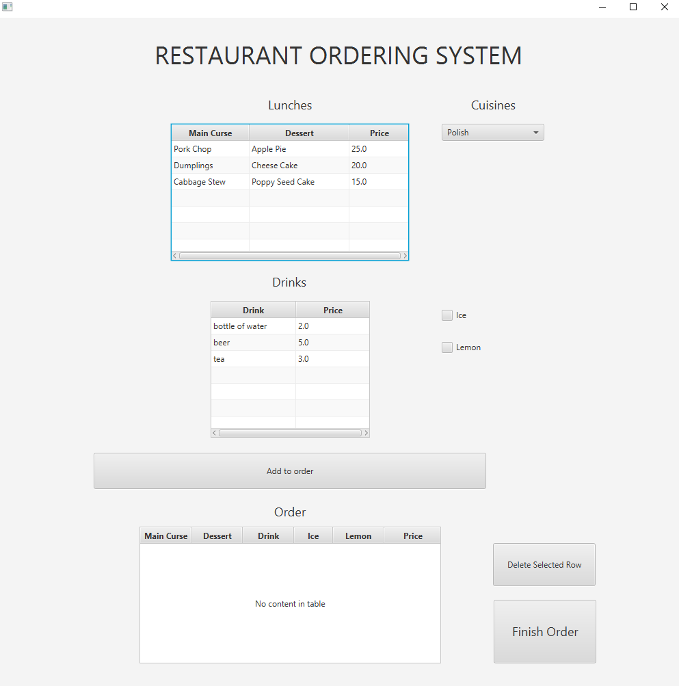
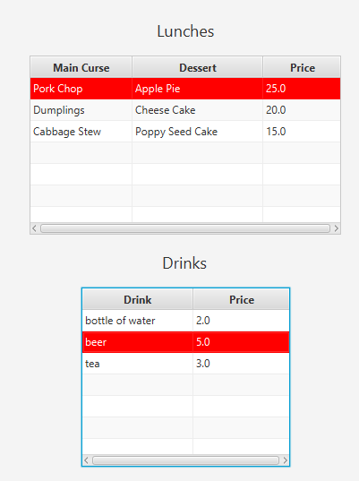
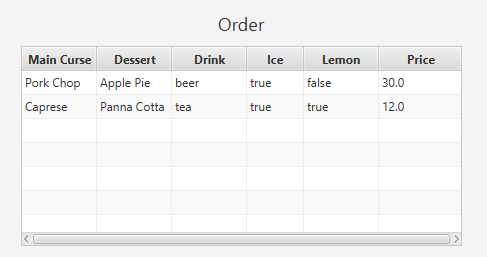
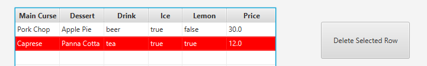
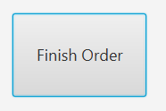
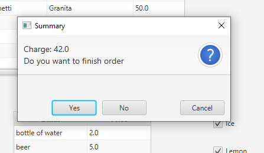

# Food Ordering System
## Table of contents
* [General info](#general-info)
* [Technologies](#technologies)
* [Setup](#setup)
* [Features](#features)
* [Basci overview](#basic-overview)

## General info
The Food Ordering System is designed to simulate food ordering in restaurant.

## Technologies
Project is created with:
* Java 11
* Spring-Boot
* JavaFx
* SQLite
* Maven

## Setup
You need Java 11 (minimum) installed to run the application. Clone this repo to your desktop or dowland zip.
The easiest way to start the application with Maven (you must have it installed on your computer)
is to open the console in the project directory and run the command:   mvn spring-boot:run
## Features
* Food ordering system
* Comunitation with database
* GUI implementation

## Basic overview
Application window Select cuisine  Select your lunch or/and drink  Select optional ice or/and lemon  
Add lunch or/and drink to your order  Order  Select and click the button to delete from order  Finish order   

